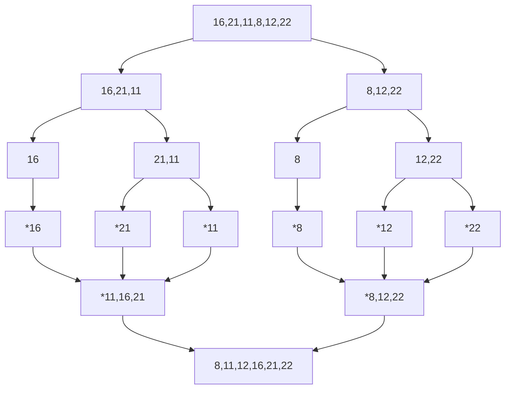

## Merge Sort Projesi
-
### `[16,21,11,8,12,22]`

### 1. Yukarıdaki dizinin sort türüne göre aşamalarını yazınız.

```mermaid
graph TD;
    16,21,11,8,12,22-->16,21,11;
    16,21,11,8,12,22-->8,12,22;
    16,21,11-->16;
    16,21,11-->21,11;
    8,12,22-->8;
    8,12,22-->12,22;
    16-->*16;
    21,11-->*21;
    21,11-->*11;
    *16-->*11,16,21;
    *21-->*11,16,21;
    *11-->*11,16,21;
    8-->*8;
    12,22-->*12;
    12,22-->*22;
    *8-->*8,12,22;
    *12-->*8,12,22;
    *22-->*8,12,22;
    *11,16,21-->8,11,12,16,21,22;
    *8,12,22-->8,11,12,16,21,22;
    
```

---

### 2. Big-O gösterimini yazınız.

  -> O ( n * logn ) 
